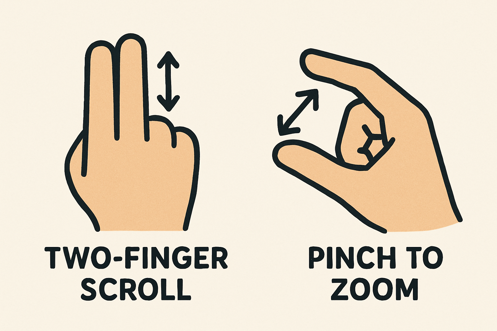

# Hand Gesture Control System

Control your computer with hand gestures using deep learning.

A physics-based system to control your computer with natural hand gestures. This project uses a ML pipeline to provide intuitive control, mimicking the feel of a trackpad but with video.



### Key Features
- **Trackpad-like Physics:** Actions like scrolling and zooming have momentum and friction, creating a smooth experience.
- **State Machine:** Understands user intent by tracking gesture states (`ACTIVE`, `RETURNING`, `NEUTRAL`), eliminating false triggers between movements.
- **Temporal Convolutional Network (TCN):** A TCN with an Attention mechanism for superior recognizing gesture sequences.
- **Feature Engineering:** Higher robustness through Procrustes alignment (rotation/scale invariance), Butterworth filtering (jitter reduction), and multi-temporal feature extraction.
- **Performance optimizations:** The model is compiled to TorchScript for faster, real-time inference on both CPU and GPU.
- **Data Collection:** A guided recorder captures complete gesture cycles, including the crucial transition phases, ensuring high-quality training data.
- 
## Quick Start

### 1. Setup (one time)
```bash
setup.bat
```
This will:
- Create a virtual environment
- Install all dependencies
- Download the hand tracking model

### 2. Record Training Data
```bash
gesture_record.bat
```
- Press 1-5 to record different gestures
- Collect 10-20 samples per gesture
- Press S to save

### 3. Train Model
```bash
gesture_train.bat
```
Trains an Temporal Convolutional neural network on your gesture data.

### 4. Use Gesture Control
```bash
gesture_control.bat
```

## Gestures

| Gesture | Action |
|---------|--------|
| Two-finger swipe downwards | Scroll up |
| Two-finger swipe upwards | Scroll down |
| Pinch open fingers | Zoom in |
| Pinch close fingers | Zoom out |
| Keep hand resting closed | No action |

## Files

- `gesture_recorder.py` - Records gesture sequences
- `train_model.py` - Trains LSTM model
- `gesture_control.py` - Real-time gesture control
- `requirements.txt` - Python dependencies
- `setup.bat` - One-time setup
- `gesture_record.bat` - Record gestures
- `gesture_train.bat` - Train model
- `gesture_control.bat` - Run control

## Requirements

- Windows 10/11
- Python 3.8+
- Webcam
- NVIDIA GPU (optional, for faster training)

## Tips

- Record gestures in good lighting
- Keep hand fully visible in camera
- Make gestures distinct and clear
- Retrain if accuracy is low
